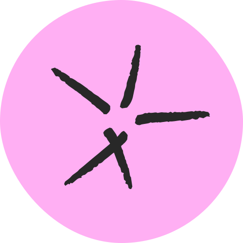

# Ready-to-go kata bootstrap projects

This repository contains starter projects for running katas in a variety of languages. All projects are using the latest language and framework versions (thanks to [renovate](https://github.com/renovatebot/)) and run on any device straight out of the box using Visual Studio Code and [devcontainers](https://code.visualstudio.com/docs/remote/containers). 

<b>In the cloud:</b> Select the language from below and click "Open in GitHub Codespace" or "Open in GitPod"

<b>In VisualStudio Code:</b> Select the language from below and click "Open in VisualStudio Code"

<b>In IntelliJ:</b> [Click here to clone this repository in IntelliJ](https://rradczewski.github.io/kata-bootstraps/redirect.html?url=jetbrains%3A%2F%2Fidea%2Fcheckout%2Fgit%3Fidea.required.plugins.id%3DGit4Idea%26checkout.repo%3Dhttps%253A%252F%252Fgitlab.com%252Fwith-humans%252Fdevops-workshop%252Finfrastructure.git%26checkout.repo%3Dhttps%253A%252F%252Fgithub.com%252Frradczewski%252Fkata-bootstraps.git) (requires [Jetbrains Toolbox](https://www.jetbrains.com/lp/toolbox/)) and select your language either by opening one of the subfolders as a project or by switching the branch.

| Language  | Resources | Test Command | Quick Start |
|---|---|---|---|
| 
<a alt="Clojure" href="./clojure"> Clojure</a>
 | [Clojure Guides](https://clojure.org/guides/getting_started) [clojure.test Reference](https://clojure.github.io/clojure/clojure.test-api.html) | `lein test` | 
<a href="https://github.com/codespaces/new?hide_repo_select=true&repo=rradczewski%2Fkata-bootstraps&ref=clojure">☁️ Open in GitHub Codespace</a>
  
<a href="https://gitpod.io/#https://github.com/rradczewski/kata-bootstraps/tree/clojure">☁️ Open in GitPod</a>
  
<a href="https://rradczewski.github.io/kata-bootstraps/redirect.html?url=vscode%3A%2F%2Fvscode.git%2Fclone%3Furl%3Dhttps%253A%252F%252Fgithub.com%252Frradczewski%252Fkata-bootstraps.git%26ref%3Dclojure">💻 Open in VSCode</a>

| 
<a alt="C# Dotnet" href="./csharp"> C# Dotnet</a>
 | [C# Reference](https://learn.microsoft.com/en-us/dotnet/csharp/language-reference/) [Dotnet Reference](https://learn.microsoft.com/en-us/dotnet/api/) [Fluent Assertions](https://fluentassertions.com/introduction) | `dotnet test` | 
<a href="https://github.com/codespaces/new?hide_repo_select=true&repo=rradczewski%2Fkata-bootstraps&ref=csharp">☁️ Open in GitHub Codespace</a>
  
<a href="https://gitpod.io/#https://github.com/rradczewski/kata-bootstraps/tree/csharp">☁️ Open in GitPod</a>
  
<a href="https://rradczewski.github.io/kata-bootstraps/redirect.html?url=vscode%3A%2F%2Fvscode.git%2Fclone%3Furl%3Dhttps%253A%252F%252Fgithub.com%252Frradczewski%252Fkata-bootstraps.git%26ref%3Dcsharp">💻 Open in VSCode</a>

| 
<a alt="Elixir" href="./elixir"> Elixir</a>
 | [elixir Reference](https://elixir-lang.org/docs.html) [ExUnit Reference](https://hexdocs.pm/ex_unit/ExUnit.html) | `mix test` | 
<a href="https://github.com/codespaces/new?hide_repo_select=true&repo=rradczewski%2Fkata-bootstraps&ref=elixir">☁️ Open in GitHub Codespace</a>
  
<a href="https://gitpod.io/#https://github.com/rradczewski/kata-bootstraps/tree/elixir">☁️ Open in GitPod</a>
  
<a href="https://rradczewski.github.io/kata-bootstraps/redirect.html?url=vscode%3A%2F%2Fvscode.git%2Fclone%3Furl%3Dhttps%253A%252F%252Fgithub.com%252Frradczewski%252Fkata-bootstraps.git%26ref%3Delixir">💻 Open in VSCode</a>

| 
<a alt="Elm" href="./elm"> Elm</a>
 | [Guide](https://guide.elm-lang.org/) [Docs](https://elm-lang.org/docs) | `npm test` | 
<a href="https://github.com/codespaces/new?hide_repo_select=true&repo=rradczewski%2Fkata-bootstraps&ref=elm">☁️ Open in GitHub Codespace</a>
  
<a href="https://gitpod.io/#https://github.com/rradczewski/kata-bootstraps/tree/elm">☁️ Open in GitPod</a>
  
<a href="https://rradczewski.github.io/kata-bootstraps/redirect.html?url=vscode%3A%2F%2Fvscode.git%2Fclone%3Furl%3Dhttps%253A%252F%252Fgithub.com%252Frradczewski%252Fkata-bootstraps.git%26ref%3Delm">💻 Open in VSCode</a>

| 
<a alt="F# Dotnet" href="./fsharp"> F# Dotnet</a>
 | [F# Reference](https://learn.microsoft.com/en-us/dotnet/fsharp/language-reference/) [Dotnet Reference](https://learn.microsoft.com/en-us/dotnet/api/) [Fluent Assertions](https://fluentassertions.com/introduction) | `dotnet test` | 
<a href="https://github.com/codespaces/new?hide_repo_select=true&repo=rradczewski%2Fkata-bootstraps&ref=fsharp">☁️ Open in GitHub Codespace</a>
  
<a href="https://gitpod.io/#https://github.com/rradczewski/kata-bootstraps/tree/fsharp">☁️ Open in GitPod</a>
  
<a href="https://rradczewski.github.io/kata-bootstraps/redirect.html?url=vscode%3A%2F%2Fvscode.git%2Fclone%3Furl%3Dhttps%253A%252F%252Fgithub.com%252Frradczewski%252Fkata-bootstraps.git%26ref%3Dfsharp">💻 Open in VSCode</a>

| 
<a alt="gleam" href="./gleam"> gleam</a>
 | [Gleam Documentation](https://gleam.run/documentation/) [Language Tour](https://gleam.run/book/tour/) [Geeunit Reference](https://hexdocs.pm/gleeunit/gleeunit/should.html) | `gleam test` | 
<a href="https://github.com/codespaces/new?hide_repo_select=true&repo=rradczewski%2Fkata-bootstraps&ref=gleam">☁️ Open in GitHub Codespace</a>
  
<a href="https://gitpod.io/#https://github.com/rradczewski/kata-bootstraps/tree/gleam">☁️ Open in GitPod</a>
  
<a href="https://rradczewski.github.io/kata-bootstraps/redirect.html?url=vscode%3A%2F%2Fvscode.git%2Fclone%3Furl%3Dhttps%253A%252F%252Fgithub.com%252Frradczewski%252Fkata-bootstraps.git%26ref%3Dgleam">💻 Open in VSCode</a>

| 
<a alt="Go" href="./golang"> Go</a>
 | [Go Reference](https://go.dev/doc/) [Ginkgo Test Runner](https://onsi.github.io/ginkgo/) [Testify Assertions](https://github.com/stretchr/testify/) | `ginkgo` | 
<a href="https://github.com/codespaces/new?hide_repo_select=true&repo=rradczewski%2Fkata-bootstraps&ref=golang">☁️ Open in GitHub Codespace</a>
  
<a href="https://gitpod.io/#https://github.com/rradczewski/kata-bootstraps/tree/golang">☁️ Open in GitPod</a>
  
<a href="https://rradczewski.github.io/kata-bootstraps/redirect.html?url=vscode%3A%2F%2Fvscode.git%2Fclone%3Furl%3Dhttps%253A%252F%252Fgithub.com%252Frradczewski%252Fkata-bootstraps.git%26ref%3Dgolang">💻 Open in VSCode</a>

| 
<a alt="Haskell" href="./haskell"> Haskell</a>
 | [Learn You a Haskell for Great Good!](http://learnyouahaskell.com/chapters) | `stack test` | 
<a href="https://github.com/codespaces/new?hide_repo_select=true&repo=rradczewski%2Fkata-bootstraps&ref=haskell">☁️ Open in GitHub Codespace</a>
  
<a href="https://gitpod.io/#https://github.com/rradczewski/kata-bootstraps/tree/haskell">☁️ Open in GitPod</a>
  
<a href="https://rradczewski.github.io/kata-bootstraps/redirect.html?url=vscode%3A%2F%2Fvscode.git%2Fclone%3Furl%3Dhttps%253A%252F%252Fgithub.com%252Frradczewski%252Fkata-bootstraps.git%26ref%3Dhaskell">💻 Open in VSCode</a>

| 
<a alt="Java" href="./java"> Java</a>
 | [Java Reference](https://www.oracle.com/pls/topic/lookup?ctx=en/java/javase&id=javaselatest) [AssertJ Reference](https://assertj.github.io/doc/) [Mockito Reference](https://javadoc.io/doc/org.mockito/mockito-core/latest/org/mockito/Mockito.html) | `mvn test` | 
<a href="https://github.com/codespaces/new?hide_repo_select=true&repo=rradczewski%2Fkata-bootstraps&ref=java">☁️ Open in GitHub Codespace</a>
  
<a href="https://gitpod.io/#https://github.com/rradczewski/kata-bootstraps/tree/java">☁️ Open in GitPod</a>
  
<a href="https://rradczewski.github.io/kata-bootstraps/redirect.html?url=vscode%3A%2F%2Fvscode.git%2Fclone%3Furl%3Dhttps%253A%252F%252Fgithub.com%252Frradczewski%252Fkata-bootstraps.git%26ref%3Djava">💻 Open in VSCode</a>

| 
<a alt="Kotlin" href="./kotlin"> Kotlin</a>
 | [Kotlin Reference](https://kotlinlang.org/docs/home.html) [Kotest Reference](https://kotest.io/docs/quickstart) | `./gradlew test` | 
<a href="https://github.com/codespaces/new?hide_repo_select=true&repo=rradczewski%2Fkata-bootstraps&ref=kotlin">☁️ Open in GitHub Codespace</a>
  
<a href="https://gitpod.io/#https://github.com/rradczewski/kata-bootstraps/tree/kotlin">☁️ Open in GitPod</a>
  
<a href="https://rradczewski.github.io/kata-bootstraps/redirect.html?url=vscode%3A%2F%2Fvscode.git%2Fclone%3Furl%3Dhttps%253A%252F%252Fgithub.com%252Frradczewski%252Fkata-bootstraps.git%26ref%3Dkotlin">💻 Open in VSCode</a>

| 
<a alt="NodeJS" href="./nodejs"> NodeJS</a>
 | [JavaScript Reference](https://developer.mozilla.org/en-US/docs/Web/JavaScript/Reference) [NodeJS Reference](https://nodejs.org/api/) [Jest Reference](https://jestjs.io/docs/getting-started) | `npm test` | 
<a href="https://github.com/codespaces/new?hide_repo_select=true&repo=rradczewski%2Fkata-bootstraps&ref=nodejs">☁️ Open in GitHub Codespace</a>
  
<a href="https://gitpod.io/#https://github.com/rradczewski/kata-bootstraps/tree/nodejs">☁️ Open in GitPod</a>
  
<a href="https://rradczewski.github.io/kata-bootstraps/redirect.html?url=vscode%3A%2F%2Fvscode.git%2Fclone%3Furl%3Dhttps%253A%252F%252Fgithub.com%252Frradczewski%252Fkata-bootstraps.git%26ref%3Dnodejs">💻 Open in VSCode</a>

| 
<a alt="PHP" href="./php"> PHP</a>
 | [PHP Getting Started](https://www.php.net/manual/en/getting-started.php) [PHP Language Reference](https://www.php.net/manual/en/langref.php) [PHP Language Reference](https://www.php.net/manual/en/langref.php) [Packagist (Registry)](https://packagist.org/) | `composer test` | 
<a href="https://github.com/codespaces/new?hide_repo_select=true&repo=rradczewski%2Fkata-bootstraps&ref=php">☁️ Open in GitHub Codespace</a>
  
<a href="https://gitpod.io/#https://github.com/rradczewski/kata-bootstraps/tree/php">☁️ Open in GitPod</a>
  
<a href="https://rradczewski.github.io/kata-bootstraps/redirect.html?url=vscode%3A%2F%2Fvscode.git%2Fclone%3Furl%3Dhttps%253A%252F%252Fgithub.com%252Frradczewski%252Fkata-bootstraps.git%26ref%3Dphp">💻 Open in VSCode</a>

| 
<a alt="PureScript" href="./purescript"> PureScript</a>
 | [Book](https://book.purescript.org/) [Getting Started](https://github.com/purescript/documentation/blob/master/guides/Getting-Started.md) | `spago test` | 
<a href="https://github.com/codespaces/new?hide_repo_select=true&repo=rradczewski%2Fkata-bootstraps&ref=purescript">☁️ Open in GitHub Codespace</a>
  
<a href="https://gitpod.io/#https://github.com/rradczewski/kata-bootstraps/tree/purescript">☁️ Open in GitPod</a>
  
<a href="https://rradczewski.github.io/kata-bootstraps/redirect.html?url=vscode%3A%2F%2Fvscode.git%2Fclone%3Furl%3Dhttps%253A%252F%252Fgithub.com%252Frradczewski%252Fkata-bootstraps.git%26ref%3Dpurescript">💻 Open in VSCode</a>

| 
<a alt="Python3" href="./python"> Python3</a>
 | [Python Reference](https://docs.python.org/3/) [PyTest Reference](https://docs.pytest.org/) | `pipenv run pytest` | 
<a href="https://github.com/codespaces/new?hide_repo_select=true&repo=rradczewski%2Fkata-bootstraps&ref=python">☁️ Open in GitHub Codespace</a>
  
<a href="https://gitpod.io/#https://github.com/rradczewski/kata-bootstraps/tree/python">☁️ Open in GitPod</a>
  
<a href="https://rradczewski.github.io/kata-bootstraps/redirect.html?url=vscode%3A%2F%2Fvscode.git%2Fclone%3Furl%3Dhttps%253A%252F%252Fgithub.com%252Frradczewski%252Fkata-bootstraps.git%26ref%3Dpython">💻 Open in VSCode</a>

| 
<a alt="ReScript" href="./rescript"> ReScript</a>
 | [ReScript Reference](https://rescript-lang.org/docs/manual/latest/introduction) [ReScript Jest Usage](https://github.com/glennsl/rescript-jest#usage) [ReScript Jest Interface Definitions](https://github.com/glennsl/rescript-jest/blob/master/src/jest.resi) | `npm run test:watch` | 
<a href="https://github.com/codespaces/new?hide_repo_select=true&repo=rradczewski%2Fkata-bootstraps&ref=rescript">☁️ Open in GitHub Codespace</a>
  
<a href="https://gitpod.io/#https://github.com/rradczewski/kata-bootstraps/tree/rescript">☁️ Open in GitPod</a>
  
<a href="https://rradczewski.github.io/kata-bootstraps/redirect.html?url=vscode%3A%2F%2Fvscode.git%2Fclone%3Furl%3Dhttps%253A%252F%252Fgithub.com%252Frradczewski%252Fkata-bootstraps.git%26ref%3Drescript">💻 Open in VSCode</a>

| 
<a alt="Ruby" href="./ruby"> Ruby</a>
 | [Ruby Reference](https://www.ruby-lang.org/en/documentation/) [RSpec Reference](https://rspec.info/) | `bundle exec rspec` | 
<a href="https://github.com/codespaces/new?hide_repo_select=true&repo=rradczewski%2Fkata-bootstraps&ref=ruby">☁️ Open in GitHub Codespace</a>
  
<a href="https://gitpod.io/#https://github.com/rradczewski/kata-bootstraps/tree/ruby">☁️ Open in GitPod</a>
  
<a href="https://rradczewski.github.io/kata-bootstraps/redirect.html?url=vscode%3A%2F%2Fvscode.git%2Fclone%3Furl%3Dhttps%253A%252F%252Fgithub.com%252Frradczewski%252Fkata-bootstraps.git%26ref%3Druby">💻 Open in VSCode</a>

| 
<a alt="Rust" href="./rust"> Rust</a>
 | [Rust Reference](https://www.rust-lang.org/learn) [Test Reference](https://doc.rust-lang.org/test/index.html) | `cargo test` | 
<a href="https://github.com/codespaces/new?hide_repo_select=true&repo=rradczewski%2Fkata-bootstraps&ref=rust">☁️ Open in GitHub Codespace</a>
  
<a href="https://gitpod.io/#https://github.com/rradczewski/kata-bootstraps/tree/rust">☁️ Open in GitPod</a>
  
<a href="https://rradczewski.github.io/kata-bootstraps/redirect.html?url=vscode%3A%2F%2Fvscode.git%2Fclone%3Furl%3Dhttps%253A%252F%252Fgithub.com%252Frradczewski%252Fkata-bootstraps.git%26ref%3Drust">💻 Open in VSCode</a>

| 
<a alt="Scala2" href="./scala2"> Scala2</a>
 | [Scala Documentation](https://docs.scala-lang.org/) [Scala2 Language Reference](https://docs.scala-lang.org/overviews/index.html) [Scala Cheatsheet](https://docs.scala-lang.org/cheatsheets/index.html) [MUnit Reference](https://scalameta.org/munit/docs/getting-started.html) | `sbt test` | 
<a href="https://github.com/codespaces/new?hide_repo_select=true&repo=rradczewski%2Fkata-bootstraps&ref=scala2">☁️ Open in GitHub Codespace</a>
  
<a href="https://gitpod.io/#https://github.com/rradczewski/kata-bootstraps/tree/scala2">☁️ Open in GitPod</a>
  
<a href="https://rradczewski.github.io/kata-bootstraps/redirect.html?url=vscode%3A%2F%2Fvscode.git%2Fclone%3Furl%3Dhttps%253A%252F%252Fgithub.com%252Frradczewski%252Fkata-bootstraps.git%26ref%3Dscala2">💻 Open in VSCode</a>

| 
<a alt="Scala3" href="./scala3"> Scala3</a>
 | [Scala Documentation](https://docs.scala-lang.org/) [Scala3 Language Reference](https://docs.scala-lang.org/scala3/reference/) [Scala Cheatsheet](https://docs.scala-lang.org/cheatsheets/index.html) [MUnit Reference](https://scalameta.org/munit/docs/getting-started.html) | `sbt test` | 
<a href="https://github.com/codespaces/new?hide_repo_select=true&repo=rradczewski%2Fkata-bootstraps&ref=scala3">☁️ Open in GitHub Codespace</a>
  
<a href="https://gitpod.io/#https://github.com/rradczewski/kata-bootstraps/tree/scala3">☁️ Open in GitPod</a>
  
<a href="https://rradczewski.github.io/kata-bootstraps/redirect.html?url=vscode%3A%2F%2Fvscode.git%2Fclone%3Furl%3Dhttps%253A%252F%252Fgithub.com%252Frradczewski%252Fkata-bootstraps.git%26ref%3Dscala3">💻 Open in VSCode</a>

| 
<a alt="Typescript" href="./typescript"> Typescript</a>
 | [TypeScript Reference](https://www.typescriptlang.org/docs/handbook/intro.html) [NodeJS Reference](https://nodejs.org/api/) [Jest Reference](https://jestjs.io/docs/getting-started) | `npm test` | 
<a href="https://github.com/codespaces/new?hide_repo_select=true&repo=rradczewski%2Fkata-bootstraps&ref=typescript">☁️ Open in GitHub Codespace</a>
  
<a href="https://gitpod.io/#https://github.com/rradczewski/kata-bootstraps/tree/typescript">☁️ Open in GitPod</a>
  
<a href="https://rradczewski.github.io/kata-bootstraps/redirect.html?url=vscode%3A%2F%2Fvscode.git%2Fclone%3Furl%3Dhttps%253A%252F%252Fgithub.com%252Frradczewski%252Fkata-bootstraps.git%26ref%3Dtypescript">💻 Open in VSCode</a>

## Contributing a bootstrap

The general paradigm of this repository is to create self-contained, minimal starter projects that are least likely to (silently) break in the future and can automatically be kept up-to-date.

Any bootstrap project may be added to this repository, if:

- The language is not yet present **or** the test-framework enables a different paradigm than the bootstraps already present for the language (e.g. a cucumber or mutation testing tool, not just junit4 or testng)
- Dependencies and docker images are well-known and commonly used
    - Avoids using custom Dockerfile-based dev-containers (they will have to be built each time a devcontainer starts)
    - Uses only one testing framework and one assertion library
- One failing, and one succeeding test exists
- Version numbers are fixed (so they can be picked up and updated by renovate)

A bootstrap needs to contain a valid [`.devcontainer.json`](./java/.devcontainer/devcontainer.json) that configures a container with all appropriate tooling. See any of the existing bootstrap projects for reference.

## Other kata bootstraps

- [swkBerlin/kata-bootstraps](https://github.com/swkberlin/kata-bootstraps) - A huge collection of kata-bootstraps in plenty of languages with plenty of different frameworks
